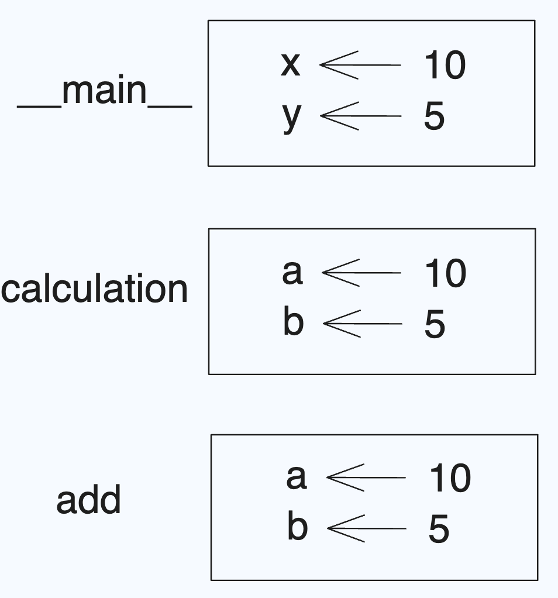

# 2. Functions

Table of Contents  
[1. Function structure](#1-function-structure)  
> [1.1 Function](#11-function)  
> [1.2 Arguments (in `print()`)](#12-arguments-in-print)  

[2. Comments and Pseudocode](#2--comments-and-pseudocode)  
[3. Create our own function by `def`](#3-create-our-own-function-by-def)  
> [3.1 First function without arguments](#31-first-function-without-arguments)  
>[3.2 Function with Arguments](#32-function-with-arguments)  
>[3.3 Function with default value](#33-function-with-default-value) 

[4.  Return values](#4--return-values)  
[5. Variables and parameters are local](#5-variables-and-parameters-are-local)  
[6. Stack diagrams and debugging](#6-stack-diagrams-and-debugging)  
[7. Organizing our code by using `main()`](#7-organizing-our-code-by-using-main)

[Summing up](#summing-up)

## 1. Function structure

**The first function: `print()`**
- In the terminal, execute `code hello.py` to start coding.
- In the text editor, type `print("Hello, World!")`. 
- To run this program, in terminal type `python hello.py` or `python3 hello.py` and press the enter/return key
- We can get `Hello, World!`

### 1.1 Function
- *Functions are verbs or actions* that the computer or computer language will already know how to perform.
- In the `hello.py` program, the `print` function knows how to print something to the terminal window.
- `print` is given by Python inventor. So we can just call it.
- In the previous part, we used other existing functions in Python, i.e., `type()`, which returns the type of data.

### 1.2 Arguments (in `print()`)

**Arguments**
- Arguments in function are the values in parenthesis.
- The `print` function takes **arguments**. In this case, `"Hello, World!"` are the arguments that the `print` function takes.

**Default arguments**
- Some functions may not need arguments, e.g., `print()`.
	```python
	name = "Jin"

	print("Hello, ")
	print(name)
	```
- The output is 
	```python
	Hello,
	Jin
	```
- If we check the python documentation at https://docs.python.org/3/library/functions.html#print. The definition of `print()` function is 
	```python
	print(*objects, sep=' ', end='\n', file=None, flush=False)
	```
- We will learn that the print function (built-in function) automatically include a piece of code `end=\n`, which indicates that the print function will automatically create a line break when run.
- We can technically provide an argument for `end` ourselves (overwrite `end` value) such that a new line is *not* created! 
	```python
	name = "Jin"

	print("Hello, ", end='')
	print(name)
	```
- we can get 
	```python
	Hello, Jin
	```

## 2.  Comments and Pseudocode

**Comments**
- Comments are a way for programmers to 
	(1) track what they are doing in their programs and even
	(2) inform others about their intentions for a block of code
- Comments are notes for yourself and others who will see your code.
- You can add comments to your program to be able to see what it is that your program is doing. 
	```python
	# put your name here
	name = "Jin"

	# print
	print("Hello, ", end='')
	print(name)
	```

**Pseudocode**
- Pseudocode is *an important type of comment* that becomes a special type of to-do list, especially when you don’t understand how to accomplish a coding task. 
- For example, in your code, you might create a to-do list
	```python
	# put the user's name

	# print the greeting
	```
- Then fulfil the to-do list
	```python
	# put the user's name
	name = "Jin"

	# print the greeting
	print("Hello, " + name)
	```

**Multi-line comment**
- Use three double or single quotation marks.
	```python
	"""
	This is my fist Python program.
	I like Python.
	I will work hard.
	"""
	```


## 3. Create our own function by `def`

### 3.1 First function without arguments
- Recall our code.
	```python
	name = "Jin"
	print("Hello, ", end="")
	print(name)
	```
- Now, suppose we have more than one students, and need to say hello to all students. We can do this
	```python
	name_1 = "Jin"
	print("Hello, ", end="")
	print(name_1)

	name_2 = "Mark"
	print("Hello, ", end="")
	print(name_2)

	name_3 = "Nancy"
	print("Hello, ", end="")
	print(name_3)
	```
- Output:
	```python
	Hello, Jin
	Hello, Mark
	Hello, Nancy
	```
- In this code, give different values to variable `name`. It will print different name, while it always prints `Hello, `. We type `print("Hello, ", end="")` repeatedly.  So we may create a function such that we can reuse the action.
- 
	```python
		def hello():
			print("Hello, ", end="")

		name_1 = "Jin"
		hello()
		print(name_1)

		name_2 = "Mark"
		hello()
		print(name_2)

		name_3 = "Nancy"
		hello()
		print(name_3)
	```
- Notice that everything under `def hello()` is **indented**. Python is an indented language. Indentation or four spaces.
- Python is going to treat lines of code that I indent underneath this line as the meaning of this new function.

### 3.2 Function with Arguments 
- We can further improve the program since the structure of the last three blocks are similar, that is, print "hello, ", then print name. So we may combine the two lines.
	```python
	def hello(nm):
		print("Hello, ", end="")
		print(nm)

	name_1 = "Jin"
	hello(name_1)

	name_2 = "Mark"
	hello(name_2)

	name_3 = "Nancy"
	hello(name_3)
	```
- Actually, we still can improve the program further after we learn more. We will discuss it later.

### 3.3 Function with default value
- Let us discuss the greeting word `Hello`. Sometimes, we may use different words, e.g., Hi, Hey, Good Morning, et. al. 
- Suppose we would like to say Hello to Jin and Mark, but Morning to Nancy. How can we revise the code above . 
- Let's create the Pseudocode.
	```python
	# create hello() function


	name_1 = "Jin"
	# say "Hello" to Jin
	hello(name_1)

	name_2 = "Mark"
	# say "Hello" to Mark
	hello(name_2)

	name_3 = "Nancy"
	# say "Morning" to Nancy
	hello(name_3)
	```
- Then finish the function
	```python
	# create hello() function
	def hello(nm, greeting="Hello "):
		print(greeting, end="")
		print(nm)

	name_1 = "Jin"
	# say "Hello" to Jin
	hello(name_1)

	name_2 = "Mark"
	# say "Hello" to Mark
	hello(name_2)

	name_3 = "Nancy"
	# say "Morning" to Nancy
	hello(name_3, "Morning ")
	```
- **NOTE:** *Default argument must follow non-default argument.*

## 4.  Return values
- Let us create a useful function `add()`, which return a summation of two numbers. 
	```python
	def add(a, b):
		c = a + b
		return c

	x = 10
	y = 5

	print(add(x, y))
	```
- `x` and `y` are passed to `add()` function. Then the calculation of `x+y` is returned back.

## 5. Variables and parameters are local
- Let us see this code:
	```python
	def add(a, b):
		c = a + b
		return c

	x = 10
	y = 5

	print(add(x, y))

	print(x)
	print(c) # will get an error
	```
- You will get an error
	```
		print(c)
			^
	NameError: name 'c' is not defined
	```
- Because *when you create a variable inside a function, it is local, which means that it only exists inside the function*.

## 6. Stack diagrams and debugging

**Call a function in another function**
- We can also call a function in another function. Now suppose we would like to calculate $(x+y)*z$ . For example, we can use the following code. 
	```python
	def add(a, b):
		c = a + b
		return c

	def calculation(a, b, c):
		rst = add(a, b) * c
		return rst

	x = 10
	y = 5
	z = 3

	print(calculation(x, y, z))
	```
- In the code, `add` function was called by `calculation` function, and `calculation` function was called by `__main__`, which is a special name for the topmost frame. When you create a variable outside of any function, it belongs to `__main__`.

**Stack diagram**
- To keep track of which variables can be used where, it is sometimes useful to draw a stack diagram.
- Each function is represented by a frame. A frame is a box with the name of a function beside it and the parameters and variables of the function inside it. The stack diagram for the previous example is shown as follows.

	

**Debugging**
- If an error occurs during a function call, Python prints the name of the function, the name of the function that called it, and the name of the function that called that, all the way back to `__main__`.
- For example, in the above code, if we mistakenly type `d` instead of `c` in line 3. 
	```python
	def add(a, b):
		c = a + b
		return d

	def calculation(a, b, c):
		rst = add(a, b) * c
		return rst

	x = 10
	y = 5
	z = 3

	print(calculation(x, y, z))
	```
- Python gives the following error:
	```
	line 13, in <module>
		print(calculation(x, y, z))

	line 6, in calculation
		rst = add(a, b) * c
			^^^^^^^^^
	line 3, in add
		return d
			^      
	```
- This list of functions is called a **traceback**.


## 7. Organizing our code by using `main()` 
- Let us see the code above, we create the `add()` function, then we may call or use it again and again. We don't want to see it, but just want to use it. Hence, *We don’t like to have our functions at the start of our program.* 
- So we may try this
	```python
	x = 10
	y = 5

	print(add(x, y))

	def add(a, b):
		c = a + b
		return c
	```
	- However, we will get an error
	```python
		print(add(x, y))
			^^^
	NameError: name 'add' is not defined
	```
- seems that the compiler doesn't know what is `add()`! This is because we cannot use it before the function is created.
- We need to tell the compiler that we have *a `main` function* and we have a separate `hello` function.
	```python
	def main():
		x = 10
		y = 5
		
		print(add(x, y))

	def add(a, b):
		c = a + b
		return c

	main()
	```
- In the code above, we *create a `main` function (means the main part of our code)*, in which `add()` function is called. However, we didn't use either `main()` or `add()` until Line 11. 

## Summing up
- `print()` function 
- Arguments in `print()`
- Comments and pseudocode
- Create function using `def`
- Arguments, default value
- Local variables
- `main()` function