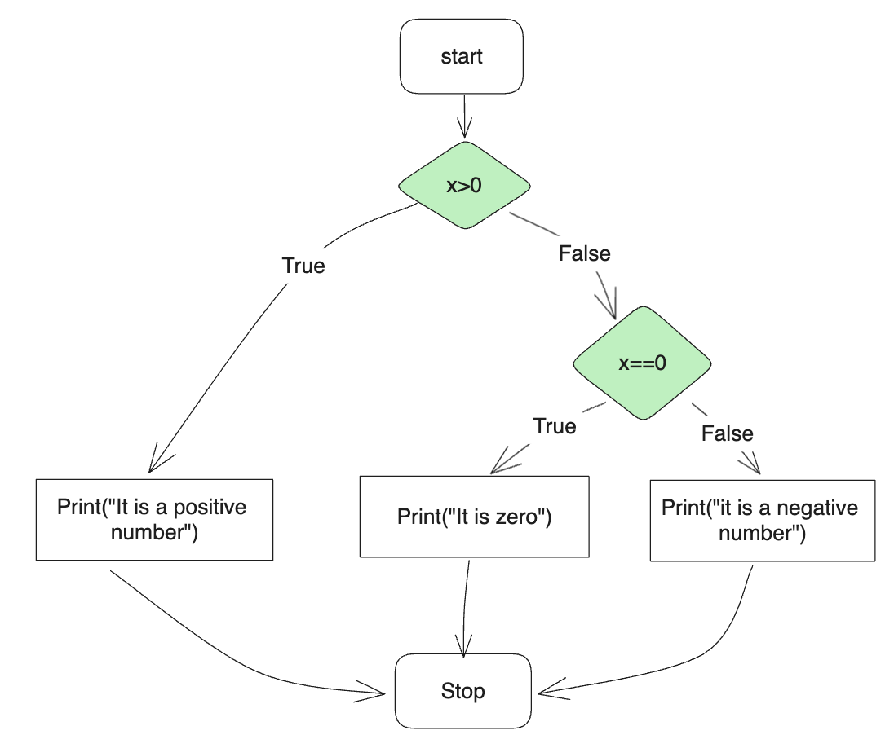

# 3. Conditionals

Table of Contents

[1. Boolean expressions](#1-boolean-expressions)  
[2. Logical operators](#2-logical-operators)  
[3. Conditional statement: `if` statement](#3-conditional-statement-if-statement)  
[4. Alternative execution: Control Flow, `else`, and `elif`](#4-alternative-execution-control-flow-else-and-elif)  
> [`else` statement](#else-statement)  
> [`elif` statement](#elif-statement)  

[5. `and`，`or` in `if` statement](#5-and-or-in-if-statement)  
[6.  Pythonic `if`](#6--pythonic-if)  
[7. Application: recursion](#7-application-recursion)  
[8. Practice questions](#8-practice-questions)  
[Summing up](#summing-up)  


## 1. Boolean expressions

**Boolean expressions**
- A *boolean expression* is an expression that is either true or false. 
- For example, the following examples use the operator ` == `, which compares two operands and produces `True` if they are equal and `False` otherwise:
	```python
	>>> 5 == 5
	True
	>>> 5 == 6
	False
	```
- `True` and `False` are special values that belong to the type `bool`; they are not strings:
	```python
	>>> type(True)
	<class 'bool'>

	>>> type(False)
	<class 'bool'>

	>>> type(7==7)
	<class 'bool'>
	```

**Relational operators**
- Python has a set of "**Operators**" that can be used to ask mathematical questions.

	| Symbol  | meaning                  |
	| ------- | ------------------------ |
	| > and < | larger and smaller       |
	| >=      | greater than or equal to |
	| <=      | less than or equal to    |
	| ==      | equals                   |
	| !=      | not equal to             |

## 2. Logical operators

- There are three logical operators: `and`, `or`, and `not`. Their semantics is similar to their meaning in English. 

**`and` operator**
- `<boolean expression A> and <boolean expression B>`. It is `True` if *both* boolean expressions are `True`.
- For example, `x > 0 and x<10` is true only if `x` is greater than 0 and less than 10. We try it in terminal.
	```python
	>>> x = 1
	>>> x > 0 and x < 10
	True
	```
- When `x = 1`, both `x > 0`  and `x < 10` are `True`. Hence the final result is `True`.
- If we change `x` to -1, we get `False` since now `x > 0` is `False`. See the code below.
	```python
	>>> x = -1
	>>> x > 0 and x < 10
	False
	```

**`or` operator**
- `<boolean expression A> or <boolean expression B>`. It is `True`  if *either or both* of the boolean expressions is `True`.  For example,
	```python
	>>> x = 1
	>>> x > 0 or x < 10
	True
	```
- In the above code, both `x > 0`  and `x < 10` are `True`. Hence the final result is `True`.
- If we change `x` to -1, we still get `True`. Now `x > 0` is `False` but `x < 10` is `True`. Hence the final result is `True`. See the code below.
	```python
	>>> x = -1
	>>> x > 0 or x < 10
	True
	```
- Let us try the following. The result is `False` now since both boolean expressions are `False`.
	```python
	>>> x = 2
	>>> x > 10 or x < 0
	False
	```

**`not` operator**
- `not` operator negates a boolean expression. `not <boolean expression>` is `True` only is the boolean expression is `False`. 
- For example,
	```python
	>>> x = 1
	>>> not (x > 1)
	True

	>>> x = 2
	>>> not (x > 1)
	False
	```

**number as boolean value**
- Strictly speaking, the operands of the logical operators should be boolean expressions, but Python is not very strict. 
- Any nonzero number is interpreted as `True`
	```python
	>>> 2 and True
	True

	>>> 0 and True
	False
	```


## 3. Conditional statement: `if` statement
(Chapter-5.4)

- When we are trying to finish some tasks, we almost always need the ability to check conditions and change the behavior of the program accordingly. Conditional statements give us this ability.
- For example, given a number, we would like to state the number is positive if it is positive. We can use a `if` statement.
	```python
	x = float(input("Please input a number: "))

	if x>0:
		print("It is a positive number.")
	```
- The `if` statement compares x with 0. If the condition of `x > 0` is met (the boolean expression is `True`), the `print` statement is executed; otherwise, not.
- `if` statements have the same structure as function definitions: a header followed by an *indented body*.

**Number of statement in the indented bodies**
- There is no limit on the number of statements that can appear in the body, but there has to be at least one. 
- Occasionally, it is useful to have a body with *no* statements (usually it is used as a place keeper for code you haven’t written yet and will be finished later). In that case, you can use the *pass statement*, which does nothing.
	```python
	x = 1
	if x>0:
		pass
	```


## 4. Alternative execution: Control Flow, `else`, and `elif`
(Chapter-5.5)
- the code
	```python
	x = float(input("Please input a number: "))

	if x>0:
		print("It is a positive number.")
	```
- The above code can only state "It is a positive number." if we input a positive number. If we input zero or a negative number, it shows nothing.
- Now let us enrich the code, which can judge whether the number inputted is positive or non-positive. We can simply add one more `if` statement.
	```python
	x = float(input("Please input a number: "))

	if x>0:
		print("It is a positive number.")

	if not (x>0):
		print("It is a non-positive number.")
	```
- Here is how we are providing two `if` statements. First, the first `if` statement is evaluated. Then, the second one is evaluated. The flow of decisions is called "control flow", which can be illustrated as follows.

	

### `else` statement
- This program can be improved since if the first `if` statement is `False`, $x$ must be not greater than 0. Hence we don't need to do the second `if` statement. Instead, we use `else`.
	```python
	x = float(input("Please input a number: "))

	if x>0:
		print("It is a positive number.")
	else:
		print("It is a non-positive number.")
	```
- The new control flow can be illustrated as follows.

	

- `if-else` statement is useful for the two options that are mutually exclusive.

### `elif` statement
- Sometimes we may have more than two options. For example, we would like to determine whether a number is (1) positive, (2) zero, and (3) negative.
- For sure, we can use three `if` statements like this.
	```python
	x = float(input("Please input a number: "))

	if x>0:
		print("It is a positive number.")

	if x==0:
		print("It is zero.")

	if x<0:
		print("It is a negative number.")
	```
- The control flow can be illustrated as follows.

	

- In the diagram, we can see we always have to answer the next question whenever the answer of the questions is `True` or `False`. Apparently, If `x>0` is `True`, it must be `False` for the next two questions. Hence it should be improved. The desired control flow should be as follows.


- We can use `if-elif` statements to implement this control flow.
	```python
	x = float(input("Please input a number: "))

	if x>0:
		print("It is a positive number.")
	elif x==0:
		print("It is zero.")
	elif x<0:
		print("It is a negative number.")

	```
 - Further improvement. Since the last question is mutually exclusive to the first two questions. So we don't necessarily need to ask the last question, but just use `else` statement, which makes the program more efficient.
	```python
	x = float(input("Please input a number: "))

	if x>0:
		print("It is a positive number.")
	elif x==0:
		print("It is zero.")
	else:
		print("It is a negative number.")
	```
 - The code can be represented as the following diagram.

	

## 5. `and`， `or` in `if` statement

- `and` and `or` can be used to connect to conditions together.
- `and` example
	```python
	x = int(input("Please input an integer: "))

	if x > 0 and x%2==0:
		print("x is a positive even number.")
	else:
		print("x is not a positive even number.")
	```
- In the above code, when the two conditions are satisfied, the code executes the `if` statement; otherwise, `else` statement.
- Similar to `and`, `or` can be used in the expression where `if` statement is executed if one of the two conditions is satisfied. For example,
	```python
	x = int(input("Please input an integer: "))

	if x > 0 or x <0:
		print("x is not zero.")
	else:
		print("x is zero")
	```
- We could improve the code as follows:
	```python
	x = int(input("Please input an integer: "))

	if x!=0:
		print("x is not zero.")
	else:
		print("x is zero")
	```

## 6.  Pythonic `if`
- 'Pythonic' code means the code only seen in Python programming.
	```python
	x = int(input("Please input an integer: "))

	text = "x is not zero." if x!=0 else "x is zero."
	print(text)
	
	```
- Notice that this return statement in our code is almost like a sentence in English. This is a unique way of coding only seen in Python.

## 7. Application: recursion
- It is legal for one function to call another; it is also legal for a function to call itself. Let us take a look at the following function.
	```python
	def countdown(n):
		if n <= 0:
			print('end')
		else:
			print(n)
			countdown(n-1)

	countdown(4)
	```
- output is
	```python
	4
	3
	2
	1
	end
	```
- The execution of countdown begins with `n=4`, and since n is greater than 0, it outputs the value 4, and then calls itself...
	- The execution of countdown begins with n=3, and since n is greater than 0, it outputs the value 3, and then calls itself...
	- ...
	- Until n=0, the execution of countdown begins with n=0, and since n is not greater than 0, it outputs the word, “end” and then returns.
- The code is just like `for` loop we will learn later. 
- Think about what's the output of the following program.
	```python
	def countdown(n):
		if n <= 0:
			print('end')
		else:
			countdown(n-1)
			print(n)

	countdown(4)
	```

## 8. Practice questions

1.  Create a function named `is_even`, which returns `True` if inputting an even number; return `False`.

2. In a right triangle, the lengths of the sides are $a$, $b$ and the hypotenuse is $c$. Pythagoras theorem says that $a^2 + b^2 = c^2$. Write a function named _check_pythagoras_ that takes parameters, $a$, $b$ and $c$, and checks to see if Pythagoras theorem holds. If it holds, the program should print "Pythagoras theorem is satisfied.". Otherwise, the program print, "No, Pythagoras theorem isn't satisfied."

3. Use `if-elif-else` statements to finish this question. Professors give letter grade based on the score a student gets in an exam. Write `Python` code which can print a letter grade given a score value.

	| Score  | Letter grade |
	| ------ | ------------ |
	| 90-100 | A            |
	| 80-89  | B            |
	| 70-79  | C            |
	| 60-69  | D            |
	| <60    | F            |
	


## Summing up
- Conditionals
- Logical operators: `or`, `and`, `not`
- `if` statements
- Control flow, `elif`, `else`
- Pythonic coding
