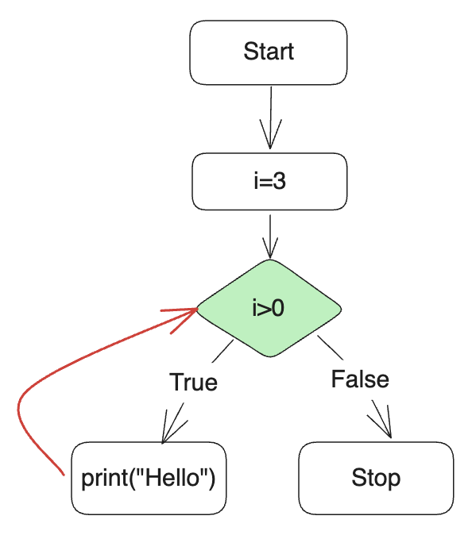
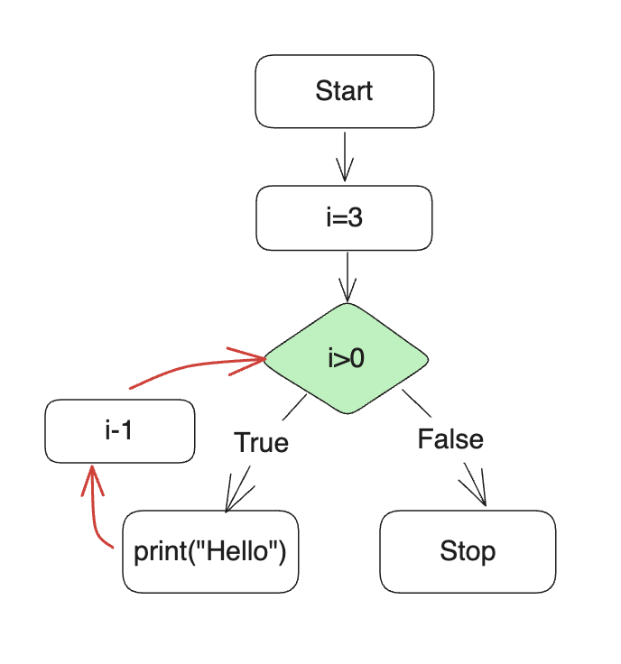

# 4 Loops

Table of contents

[1. Updating variables](#1-updating-variables)  
[2. repetitions and loops](#2-repetitions-and-loops)  
[3. `while` loops](#3-while-loops)  
[4. List basics](#4-list-basics)  
[5. for loops](#5-for-loops)  
[6. continue, break](#6-continue-break)  
[7. Practice questions](#7-practice-questions)

## 1. Updating variables.
(Chapter 7.1 & 7.2)

**Reassignment**
- We mentioned assignments at the beginning, where a value can be assigned to a variable. It is done by using the equal sign ($=$).  For example,
	```python
	x = 1
	```
- It is legal to make more than one assignment to the same variable. A new assignment makes an existing variable refer to a new value.
	```python
	x = 1
	x = 2
	print(x)
	```
- In the code above, `x` was assigned value `1` first, then it was reassigned to being `2`. 
- Also, in mathematics, a proposition of equality is either true or false for all time. If $a = b$ now, then a will always equal b. In Python, an assignment statement can make two variables equal, but they don’t have to stay that way. Let's think what is the value of `y` after we run the following program.
	```python
	x = 1
	y = x
	x = 2
	print(y)
	```
- The result is `1`. In the first line, `x` is assigned `1`. In the second line, `y` is assigned the value of `x`, which is `1`.  The third line changes the value of `x`, but does not change the value of `b`, so they are no longer equal.

**Updating variables**
- A common kind of reassignment is an *update*, where the new value of the variable depends on the old value.
	```python
	x = 1
	x = x + 1
	```
- Again, the equal sign $=$ means assignment, rather than "equal to". The value `x+1` is assigned to `x`, hence the value of `x` is updated. The value of `x` is `2` after running the code above.
- For sure you need the value of `x` before updating it. If you try to update a variable that doesn't exist, you get an error, because Python evaluates the right side before it assigns a value to $x$:
	```python
	>>> x = x + 1
	NameError: name 'x' is not defined
	```
- Updating a variable by adding 1, `x=x+1`, is called an **increment**; subtracting 1, `x=x-1`, is called a **decrement**.
- Increment can also be written as `x+=1`. Similarly, decrement can be written as `x-=1`. 

## 2. Repetitions and Loops

- Sometimes we need to repeat something more than one time. Let us begin with the following code:
	```python
	print("Hello")
	print("Hello")
	print("Hello")
	```
- Running the code above, we will notice that the program says "Hello" three times.
- As a programmer, when you would like to do something over and over again, you may need to consider how we can improve your code. Three times are fine. How about 1000 times? Do you want to type `print(Hello)` 1000 times?
- For sure, not! Python inventor (or any other programming language inventor) created loops, which enable us to create a block of code to execute repetitions.
- *Loops* are a way to repeat something over and over again. It is also called *iteration*.

## 3. `while` loops
- The `while` loop is nearly universal throughout all programming languages. You can see it in C, C++, Java, et. al.
- The syntax is just like `if`:
	```python
	while <condition>:
		<block>
	```
- Let us use `while` loops to print `Hello` three times.
	```python
	i = 3
	while i>0:
		print("Hello")
	```
- Run this program. This program really prints "Hello". However, it prints too many "Hello" and will _never stop!_
- You can press `control+c` keys to stop the program, when you get stuck in Python.
- Let us use the following diagram to show how `while` loops work. 

	

	- The program examines whether the condition `i>0` is satisfied. If true, it will print "Hello"; stop otherwise. In our program, `i` value is 3, indicating `i>0` is True. So the program will print "Hello". 
	- After that, it will go back to the condition again to see whether the condition is still satisfied. If True, continue. Then repeat this process over and over again.
	- You can see the condition `i>0` is always satisfied since `i` value is 3.
- Try to think how to solve this problem. 
- We can change the `i` value, i.e., update `i` value, by code `i=i-1`. Try the following program.
	```python
	i = 3
	while i>0:
		print("Hello")
		i = i - 1
	```
- It works now. It prints "Hello" three times. The above `while` loops can be expressed using this diagram.

	


- Sure, we can change `i=i-1` to `i-=1` (decrement), which makes the program more concise. 
	```python
	i = 3
	while i>0:
		print("Hello")
		i-=1
	```
- Above, we are starting `i` at three, then two, one. It is not so natural for most humans. We like count forward, 1, 2, 3, ... It’s best practice in programming to begin counting with zero. Hence, we can improve the code as follows.
	```python
	i = 0
	while i<3:
		print("Hello")
		i+=1
	```

## 4. List basics

**List**
- List is a container in Python. A list is a sequence of values, which can be any type. 
- We can define the following lists.
	```python
	names = ["Jin", "Mark", "Neil"]
	numbers = [3, 8, 8]

	print(names)
	print(numbers)
	```

**Getting access to the elements**
- We can get access to the elements in a list by using the indices. Note that the index starts with 0.
	```python
	names = ["Jin", "Mark", "Neil"]
	numbers = [3, 8, 8]

	print(names[0])
	print(names[1])
	print(names[2])

	print(numbers[0])
	print(numbers[1])
	print(numbers[2])
	```

**Updating the elements**
- We can update the elements by assigning new values.
	```python
	numbers = [3, 8, 8]
	numbers[2] = 5

	print(numbers)
	```

**`range()` function**
- The function `range()` can give us a range of number.
	```python
	numbers_range = range(3)
	numbers_list = list(numbers_range)

	print(numbers_list)
	```
- The output is `[0, 1, 2]`

**len() function to obtain length**
- The function `len()` returns the length of a list.
	```python
	numbers = [3, 8, 8]
	l = len(numbers)
	print(l)
	```
- The output is 3.

## 5. `for` loops

- `for` loops are another statements which can be used for do something repeatedly. The following program is to print "Hello" three times using `for` loops.
	```python
	for i in [0, 1, 2]:
		print("Hello")
	```
- The output is just the same as `while` loop statements above.
- In the above program, we traverse a list `[0, 1, 2]`. First, `i` takes the first value in the list, which is `1`; then execute the indented body, that is `print("Hello")`. After that, `i` takes the second value in the list, which is `2`; then execute the indented body again. After that, continue traversing the list and execute the indented body.
- We can improve the code by using `range()`:
	```python
	for i in range(3):
		print("Hello")
	```
- Our code can be further improved. Notice, we never use `i` explicitly in the indented body. The usage of `i` value is just for the iterations of the loop. In Python, if such a variable does not have any other significance in our code, we can simply represent this variable as a single underscore `_`. Therefore, you can modify your code as follows:
	```python
	for _ in range(3):
		print("Hello")
	```
- Now let us use `for` loops to print elements in a list. Since `for` loop traverses the list, we can use the following code.
	```python
	for i in ["Jin", "Mark", "Neil"]:
		print(i)
	```
- First, `i` takes the first value in the list, which is “Jin”; then execute the indented body, that is `print(i)`, where `i` value is "Jin". Then, `i` takes the second value, so on so forth.
-  We can make the code more elegant.
	```python
	names = ["Jin", "Mark", "Neil"]
	for i in names:
		print(i)
	```

**Traversing a list via indices in `for` loop**
- We can also traverse a list via indices in `for` loop. For example,
	```python
	names = ["Jin", "Mark", "Neil"]
	n = len(names)
	for i in range(n):
		print(names[i])
	```
- It seems redundant since we can traverse a list directly. However, it is very useful when we want to update or write the elements.
	```python
	numbers = [3, 8, 8]
	n = len(numbers)

	for i in range(n):
		numbers[i] = numbers[i] * 2

	print(numbers)	
	```

## 6. `continue`, `break`

**break**
- In a previous question, we want to give letter grade given a score (between 0 and 100). However, we didn't give a program to let user correct the input. Let's create it by using loops.
	```python
	while True:
		n = int(input("Please input a score (0-100): "))
		if 0<=n<=100:
			break

	print(n)
	```
- In the above program, *`break` tells Python to “break out” of a loop early, before it has finished all of its iterations. *
- This program will reprompt the use with "Please input a score (0-100):  " when the user's input is not within the range (0-100). 
- If the input is in the range, the program will execute `break` to exit the loops.

**continue**
- Different from `break`, *`continue` tells Python to go to the next iteration for a loop and ignore the code after `continue`*. For example,
	```python
	for i in range(4):
		if i == 1:
			continue

		print(i)
	```
- Output is
	```python
	0
	2
	3
	```
- There is not 1 in the output since when `i` value is 1 Python executed `continue` which results in ignoring the code after Line 3.

## 7. Practice Questions

1. Create a function named `get_maximum` taking a list of numbers, which can return the maximum number in the list.

2. Create a function taking a list, which can print out the 2nd value, 4th value, 6th value, ... . For example, given a list `x = ['a', 'b', 'c', 'd']`, the output should print 'b' and 'd'. (try to use `continue` in the loop)

3. Calculate the sum of  1 to $n$.
	- Create a function named `get_number` which returns a positive number. In the function you use `input` function to let user input a positive integer. If user inputs a negative number, reprompt the user with "Please input a positive number: " .
	- Create a function named `get_sum` taking a number $n$ and returning the sum of 1 to  $n$.
	- Create a `main` function which calls the two functions above to calculate the sum of 1 to $n$.

4. Given a list of numbers, try to print the numbers starting with the first one and stop when the sum of the numbers collected is larger than 100.
 